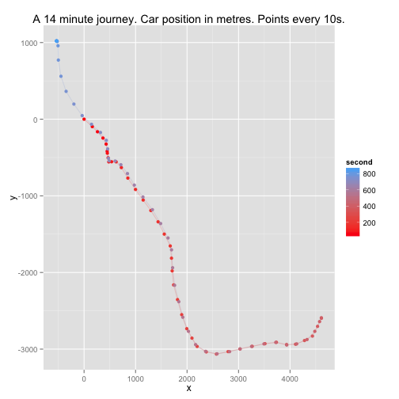
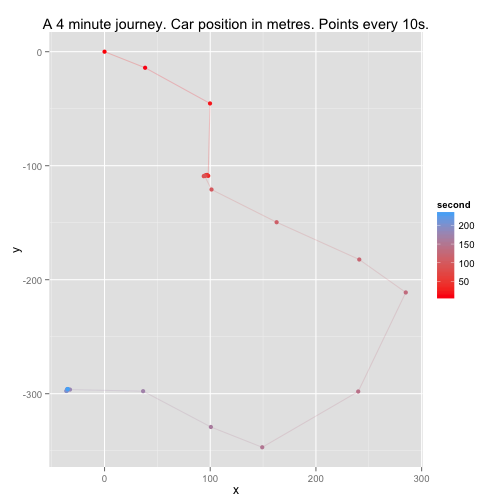
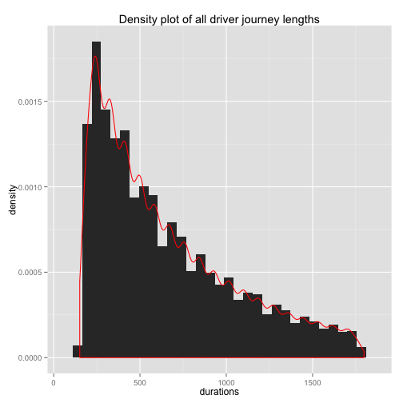
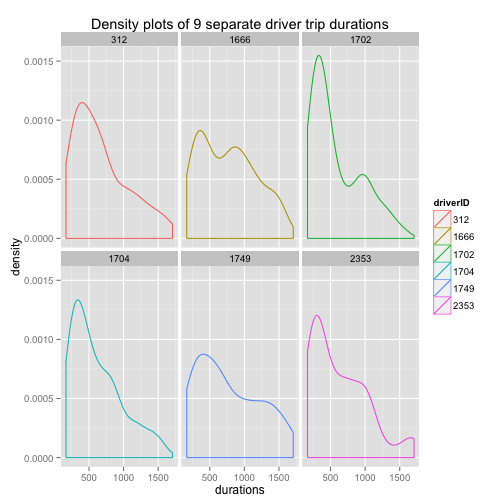

Driver Telematics Competition
========================================================
author: James Owers
date: February 12th, 2013
font-family: 'Helvetica'
autosize: true

What is Telematics?
========================================================
- Vehicle telematics is the analysis of driver characteristics via sensors such as GPS and accellerometers[^1][1]
- GPS tracking is usually accurate to around 10–20 metres, but the European Space Agency has developed the EGNOS technology to provide accuracy to 1.5 metres.

[1]: http://www.ingenie.com/telematics "Description of Vehicle Telematics"

Task
========================================================
left:30%

***
- Come up with a "telematic fingerprint" for drivers so, given a trip, the driver can be identified
- Specifically we are given a bunch of journeys which are predominantly from Driver A, but a random (small) number are from Driver B^*
- We must assign the probability Driver A was driving each journey
- Repeat for all drivers

--
\* Driver B is not in our sample of drivers

Data [1/2]
========================================================
- 2736 drivers^\*, 200 trips each
- Zipped folders
    - one folder per driver
    - each folder contains 200 csv files
- Each csv is simply (x,y) locations, one row per second:

x   | y
--- | ---
0.0 | 0.0
18.6|-11.1
36.1|-21.9
... | ...

***

- Anonymised
    - Centring at origin
    - Short lengths of trip data were removed from the start/end of the trip
    - Rotated

***
\* folders are numbered up to 3612 BUT there are gaps! [^1][1]

[1]: http://www.kaggle.com/c/axa-driver-telematics-analysis/forums/t/11327/are-there-no-drivers-400-999 "gaps"

Data [2/2]
========================================================
 

***

 

Assessment Method - AUC
========================================================

***

Low Hanging Fruit
========================================================
- Classic Kaggle "Beat the benchmark" Solution [(forum post)][1]
    - Already coded import from zip
    - Computes just one feature: speed
    - Logistic regression
    - 1hr runtime
    - AUC = 0.66 (top submission ATOW > 0.96)
    - Add duration
    - Add [Centripetal accelleration](https://thecuriousastronomer.wordpress.com/2014/09/15/derivation-of-centripetal-acceleration-using-polar-coordinates/)
- Preprocessing the data to smooth the trips
    - Use smoothing as described in [this forum post][2]
- Read 4 papers on [this forum post][3]
[1]: http://www.kaggle.com/c/axa-driver-telematics-analysis/forums/t/11299/score-0-66-with-logistic-regression "Beat the benchmark logistic"
[2]: http://www.kaggle.com/c/axa-driver-telematics-analysis/forums/t/11288/hyperspace-jumps-or-paused-gps-tracking "Smoothing"
[3]: http://www.kaggle.com/c/axa-driver-telematics-analysis/forums/t/11399/some-interesting-papers "interesting papers"

Benchmark Solution
========================================================
Fits a logistic regression for each driver
- Pick 5 drivers at random to use as the negative sample
- Genarate dataset of all trips generate features (simply 20 speed quintiles)
- For each driver:
    - Import all trips and generate features
    - Fit a logistic model for these trips against the random 5 selected
    - Predict probability of each trip
- ...That's it!

Data Analysis
========================================================

Trip Durations - All
========================================================
 

Trip Durations - Individuals
========================================================

 

- Plot a single driver's trips in one plot
========================================================

Feature Ideas
========================================================
Inspired from AXA desription:
- Average length of trip (possibly interacting with time of day)
- Road type preference (Highways/Back roads)
- Stopping style (Decelleration time)
- Turning style (Average speed turns taken at)?
- Trip similarity (Commutes/travelling)
- Average distance from start and finish points (round trips?)
- How many stop points?
